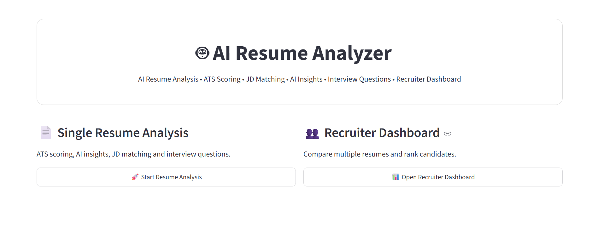
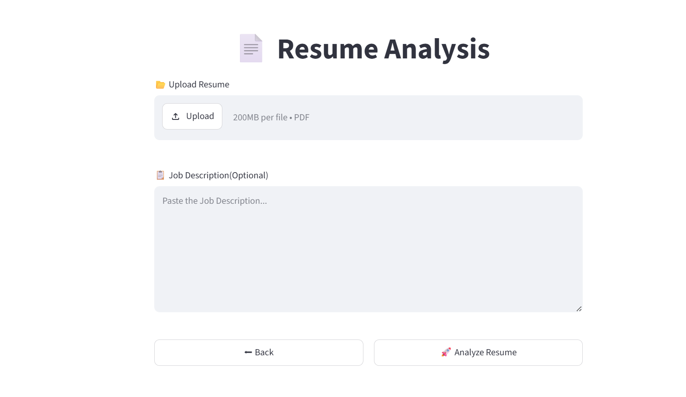
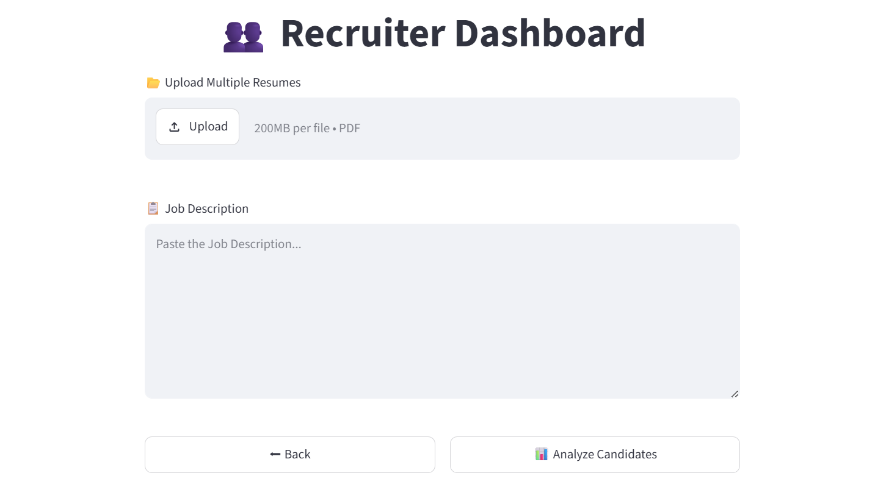

# 🤖 AI Resume Analyzer & Recruiter Dashboard

An AI-powered Resume Analyzer and Recruiter Dashboard built using **Python, Streamlit, and Groq LLM API**. The application helps job seekers evaluate their resumes with ATS scoring and AI-generated feedback while enabling recruiters to compare multiple resumes, rank candidates, and identify the best candidate based on job description matching.

---

## ✨ Features

### 👤 Candidate Resume Analysis
- Upload Resume (PDF)
- ATS Score Calculation
- AI-Powered Resume Analysis
- Resume Summary
- Skill Extraction
- Missing Skills Detection
- Job Description Matching
- Candidate Information Extraction
- Resume Improvement Suggestions
- AI-Generated Interview Questions
- Downloadable PDF Report

### 👨‍💼 Recruiter Dashboard
- Upload Multiple Resumes
- Upload Job Description
- Compare Candidates
- ATS Score Ranking
- Skill Match Analysis
- Missing Skills Comparison
- Candidate Information Display
- Best Candidate Recommendation
- Interactive Dashboard

---

## 🛠️ Tech Stack

- Python
- Streamlit
- Groq API (LLM)
- Pandas
- PyPDF2
- ReportLab
- python-dotenv
- Regular Expressions (Regex)

---
# 📂 Project Structure

```text
AI_Resume_Analyzer_&_Recruiter_Dashboard/
│
├── app.py
├── requirements.txt
├── README.md
├── .gitignore
├── .env.example
│
├── data/
│   ├── role_skills.json
│   └── skills.csv
│
├── modules/
│   ├── ai_analysis.py
│   ├── ats_score.py
│   ├── candidate_details.py
│   ├── interview_generator.py
│   ├── jd_matcher.py
│   ├── missing_skills.py
│   ├── parser.py
│   ├── pdf_report.py
│   ├── resume_ranker.py
│   └── skills.py
│
├── pages/
│   ├── 1_Resume_Analysis.py
│   ├── 2_Resume_Results.py
│   ├── 3_Recruiter_Dashboard.py
│   └── 4_Recruiter_Results.py
│
├── image.png
├── image-1.png
└── image-2.png
```

---

## 🚀 Installation

### Clone the repository

```bash
git clone https://github.com/your-username/AI_Resume_Analyzer_&_Recruiter_Dashboard.git
```

### Navigate to the project

```bash
cd AI_Resume_Analyzer_&_Recruiter_Dashboard
```

### Install dependencies

```bash
pip install -r requirements.txt
```

### Create a `.env` file

```env
GROQ_API_KEY=your_groq_api_key
```

### Run the application

```bash
streamlit run app.py
```

---

## 📊 Project Workflow

1. Upload Resume (PDF)
2. Extract Resume Text
3. Parse Candidate Information
4. Calculate ATS Score
5. Compare Resume with Job Description
6. Generate AI Resume Feedback
7. Generate Interview Questions
8. Download PDF Report

Recruiters can:

- Upload multiple resumes
- Compare candidates
- View ATS scores
- Analyze skill matching
- Identify missing skills
- Select the best candidate

---

## 📸 Screenshots

### Home Page


### Resume Analysis


### Recruiter Dashboard


---

## 🎯 Future Improvements

- User Authentication
- Resume Database
- DOCX Resume Support
- Advanced NLP Resume Parsing
- Resume History
- Cloud Deployment
- Enhanced AI Recommendations

---

## 📚 Learning Outcomes

This project helped me gain practical experience in:

- Python Programming
- Streamlit Web Application Development
- Groq LLM API Integration
- Resume Parsing
- ATS Score Calculation
- Prompt Engineering
- PDF Processing
- Data Analysis with Pandas
- Regular Expressions (Regex)

---

## 👨‍💻 Author

**Tejaswini Madarapu**

B.Tech - AIML

GitHub: https://github.com/Tejaswini8888

LinkedIn: https://linkedin.com/in/tejaswini-madarapu

---

## 📄 License

This project is created for educational and portfolio purposes.